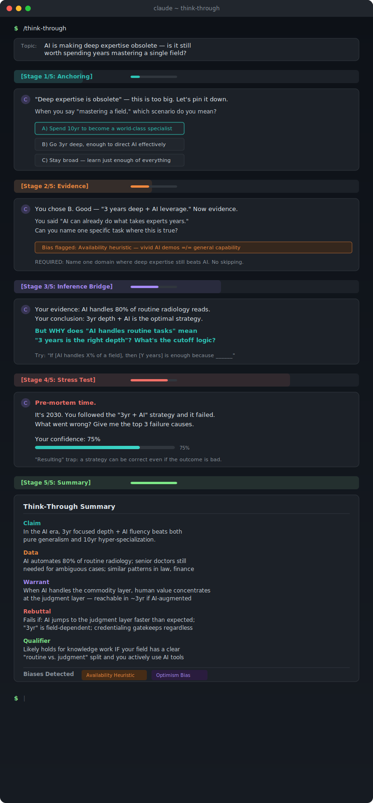
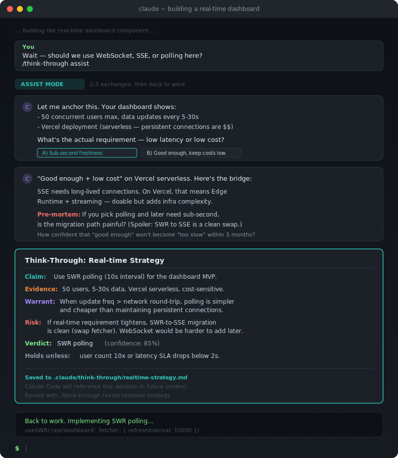
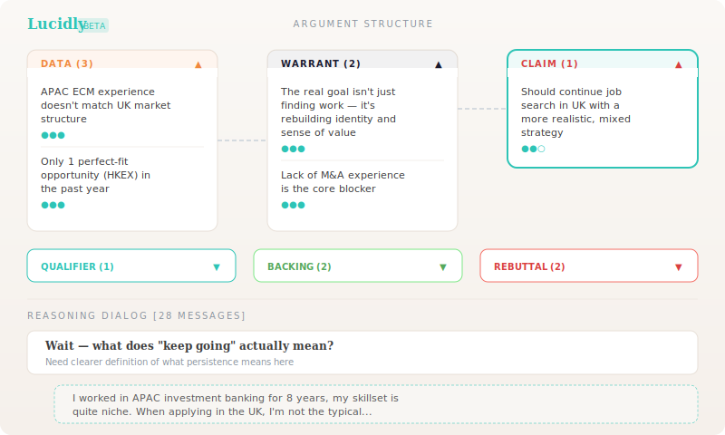
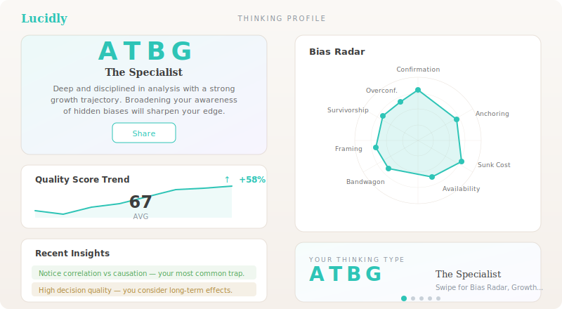
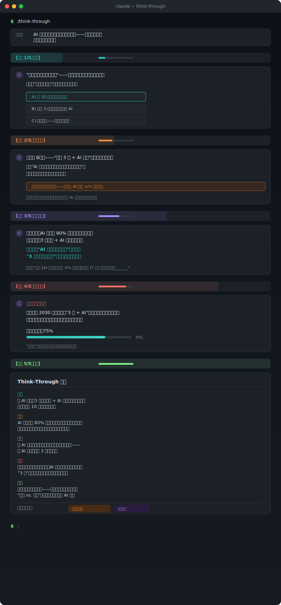
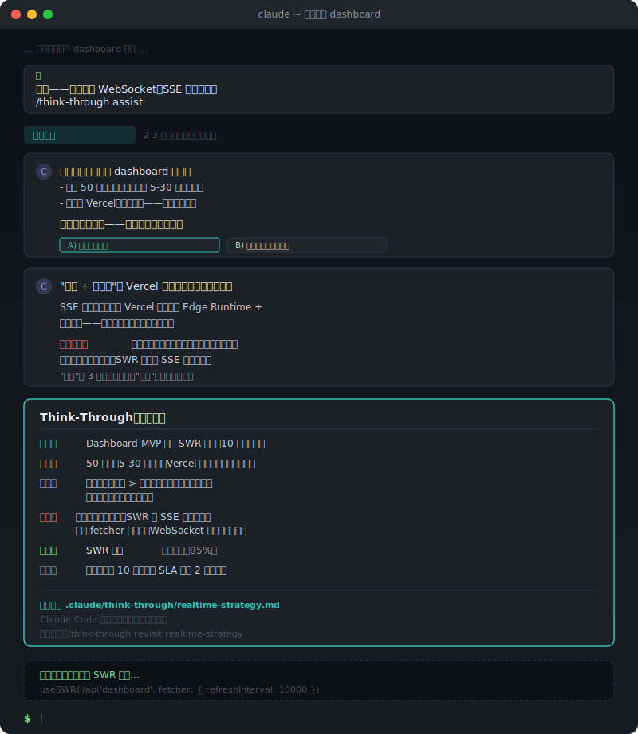

<div align="center">

# `/think-through`

### A Critical Thinking Engine for Claude Code

**5-stage reasoning state machine** that turns vague intuitions into structured arguments.

Built on [Toulmin](https://en.wikipedia.org/wiki/Toulmin_method) argument structure, [Paul-Elder](https://www.criticalthinking.org/pages/our-concept-and-approach/19) critical thinking elements, and [Intellectual Standards](https://www.criticalthinking.org/pages/universal-intellectual-standards/527) as quality gates.

[](https://docs.anthropic.com/en/docs/claude-code)
[](LICENSE)

**English** | [中文](#中文)

</div>

<br/>

---

## Why This Exists

> **"Figuring out what questions to ask will be more important than figuring out the answer."**
>
> — Sam Altman, CEO of OpenAI ([CNBC, Jan 2025](https://www.cnbc.com/2025/01/13/openai-ceo-top-ability-you-need-to-succeed-age-of-ai-ask-great-questions.html))

We live in a strange moment. AI can write code, draft essays, and pass bar exams — yet the most valuable human skill isn't *answering* questions, it's *asking* the right ones.

The World Economic Forum ranks **critical thinking and problem-solving as the #1 most in-demand skill for 2025** ([WEF Future of Jobs Report](https://www.weforum.org/publications/the-future-of-jobs-report-2025/)). Anthropic CEO Dario Amodei puts it simply: even in highly automated industries, **"someone needs to be steering — that's where humans remain"** ([The Adolescence of Technology](https://www.darioamodei.com/essay/the-adolescence-of-technology)).

The pattern is clear:

| What AI does well | What AI can't do for you |
|---|---|
| Generate answers | Know which question to ask |
| Summarize evidence | Judge if the evidence is trustworthy |
| Produce arguments | Detect your own blind spots |
| Optimize solutions | Question whether you're solving the right problem |

**AI is an accelerator, not a replacement, for human judgment** ([Thinkist](https://www.thinkist.com/the-age-of-ai-demands-a-critical-thinking-renaissance/)). The irony? The best way to sharpen your thinking might be to have AI *challenge* it — not agree with it.

That's what `/think-through` does.

---

## Demo

### Case 1: Standalone — Deep Question

> *"AI is making deep expertise obsolete — is it still worth spending years mastering a single field?"*

<div align="center">


<sub>Full 5-stage session: Anchoring > Evidence > Inference Bridge > Stress Test > Toulmin Summary</sub>
</div>

<br/>

### Case 2: Assist — Mid-Coding Decision

> While vibe-coding a dashboard, you hit an architecture fork: WebSocket vs SSE vs polling?

<div align="center">


<sub>2-3 exchanges, structured verdict saved to .claude/ — Claude Code references it going forward</sub>
</div>

---

## Install

```bash
# Clone
git clone https://github.com/MidniteCome/think-through.git

# Copy to Claude Code skills
mkdir -p ~/.claude/skills/think-through
cp -r think-through/SKILL.md ~/.claude/skills/think-through/SKILL.md
```

Restart Claude Code. `/think-through` is ready.

---

## Usage

### Standalone Mode — Deep Reasoning Session

```
/think-through AI is making deep expertise obsolete — should I still go deep?
```

Walks you through all 5 stages with interactive questions, bias detection, and a final Toulmin-structured summary.

### Assist Mode — Vibe Coding Companion

```
/think-through assist Should we use WebSocket, SSE, or polling for this dashboard?
```

Compressed into 2-3 exchanges. Outputs a structured decision card saved to `.claude/think-through/`, which Claude Code uses as context for subsequent work. Returns control to your coding session immediately.

---

## How It Works

### The 5-Stage State Machine

<div align="center">

</div>

<br/>

| Stage | Goal | Quality Gate | Key Technique |
|:---:|---|---|---|
| **1. Anchoring** | Crystallize a vague feeling into a specific question | Clarity | Fermi decomposition for overly broad questions |
| **2. Evidence** | Collect, verify, and challenge evidence | Accuracy + Breadth | Force counter-evidence (anti-WYSIATI) |
| **3. Bridge** | Articulate *why* evidence supports the claim | Logicalness | Warrant extraction — the invisible reasoning step |
| **4. Stress Test** | Find conditions where the conclusion *fails* | Fairness + Depth | Pre-mortem (Kahneman) + Confidence calibration (Tetlock) |
| **5. Summary** | Synthesize into a structured conclusion | — | Complete Toulmin diagram + bias report |

Each stage has a **pass condition** — you can't skip ahead until the quality gate is met.

### The Toulmin Backbone

Every reasoning session builds a [Toulmin argument](https://en.wikipedia.org/wiki/Toulmin_method) — the gold standard for structured argumentation:

<div align="center">

</div>

<br/>

Most people provide **Data** (evidence) and jump straight to a **Claim** (conclusion). They skip the **Warrant** — the reasoning that explains *why* the evidence actually supports the claim. Stage 3 (Inference Bridge) exists specifically to surface this invisible leap.

### Three Theoretical Frameworks

```
Toulmin     =  skeleton   →  ensures the argument has structure
Paul-Elder  =  compass    →  enriches thinking across 8 dimensions
Standards   =  gateway    →  quality control at each stage transition
```

The skill doesn't lecture you about frameworks. It uses them under the hood to generate **specific, substantive questions** about *your* actual content.

### Bias Detection

The skill watches for common reasoning traps and flags them in real-time:

- **Social Proof** — "Everyone says so" without concrete examples
- **Confirmation Bias / WYSIATI** — All evidence pointing one direction
- **Correlation ≠ Causation** — Post hoc reasoning
- **Halo Effect** — Logical leaps from evidence to conclusion
- **Optimism Bias** — Overconfidence in outcomes
- **Sample Size Neglect** — Generalizing from 1-2 examples

---

## Lucidly — The Full Experience

`/think-through` is the CLI distillation of **[Lucidly](https://lucidly-tau.vercel.app)**, a full-featured critical thinking web app. Here's what the web version adds:

### Toulmin Argument Structure

Every session produces a visual Toulmin diagram — Data, Warrant, Claim, Qualifier, Backing, Rebuttal — all color-coded and expandable.

<div align="center">

</div>

<br/>

### Thinking Profile + Bias Radar + Wrapped

Your reasoning sessions build a personal thinking profile over time: a 16-type classification, bias radar chart, quality score trend, and a Spotify Wrapped-style annual report.

<div align="center">

</div>

<br/>

### And More

- **6 Training Exercises** — Socratic Flow, Devil's Advocate, Pre-Mortem, Persuasion Scan, Decision Quality, Probability Calibration
- **Paul-Elder Octagon** — Radial visualization of 8 thinking elements with interactive relationship edges
- **Shareable Cards** — Canvas-rendered images of your Thinking Type and insights

<div align="center">

### [Try Lucidly →](https://lucidly-tau.vercel.app)

<sub>Next.js + Supabase + Claude API. Bilingual (EN/CN).</sub>

</div>

---

## Philosophy

Most "AI thinking tools" are just wrappers around "here's a longer prompt." This is different.

The 5-stage state machine is derived from established frameworks in argumentation theory (Toulmin), critical thinking pedagogy (Paul-Elder), and cognitive psychology (Kahneman's pre-mortem, Tetlock's superforecasting, Annie Duke's decision quality).

The key insight: **AI shouldn't agree with you — it should challenge you.** Every stage is designed to increase friction where your thinking is weakest, and only move forward when the quality gate passes.

The result isn't a better answer. It's a better *question*.

---

## License

MIT

---

<div align="center">
<sub>Built by <a href="https://github.com/MidniteCome">William Choi</a> as part of the <a href="https://lucidly-tau.vercel.app">Lucidly</a> project.</sub>
</div>

<br/>
<br/>
<br/>

---

<div align="center">

<a id="中文"></a>

# `/think-through`

### Claude Code 批判性思维引擎

**5 阶段推理状态机**，把模糊的直觉变成结构化的论证。

基于 [Toulmin](https://zh.wikipedia.org/wiki/%E5%9B%BE%E5%B0%94%E6%98%8E%E6%A8%A1%E5%9E%8B) 论证结构、[Paul-Elder](https://www.criticalthinking.org/pages/our-concept-and-approach/19) 批判性思维要素，以及知性标准作为质量门控。

[](https://docs.anthropic.com/en/docs/claude-code)
[](LICENSE)

[English](#think-through) | **中文**

</div>

<br/>

---

## 为什么做这个

> **"搞清楚该问什么问题，会比搞清楚答案本身更重要。"**
>
> — Sam Altman, OpenAI CEO ([CNBC, 2025 年 1 月](https://www.cnbc.com/2025/01/13/openai-ceo-top-ability-you-need-to-succeed-age-of-ai-ask-great-questions.html))

我们正处在一个奇怪的时刻。AI 能写代码、写论文、通过律师资格考试——但人类最值钱的能力不是*回答*问题，而是*提出*正确的问题。

世界经济论坛将**批判性思维和解决问题列为 2025 年最紧缺的第一技能** ([WEF 未来就业报告](https://www.weforum.org/publications/the-future-of-jobs-report-2025/))。Anthropic CEO Dario Amodei 说得直白：即使在高度自动化的行业里，**"总得有人掌舵——那就是人的位置"** ([The Adolescence of Technology](https://www.darioamodei.com/essay/the-adolescence-of-technology))。

规律很清晰：

| AI 擅长的 | AI 替代不了的 |
|---|---|
| 生成答案 | 知道该问什么问题 |
| 总结证据 | 判断证据是否可信 |
| 构造论点 | 发现自己的盲区 |
| 优化方案 | 质疑你是否在解决正确的问题 |

**AI 是人类判断力的放大器，不是替代品** ([Thinkist](https://www.thinkist.com/the-age-of-ai-demands-a-critical-thinking-renaissance/))。讽刺的是，磨练思维最好的方式，可能是让 AI 来*挑战*你的想法——而不是附和它。

这就是 `/think-through` 做的事。

---

## 演示

### 案例一：独立模式 — 深度问题

> *"AI 正在让深度专业知识变得过时——还值得花几年精通一个领域吗？"*

<div align="center">


<sub>完整 5 阶段：锚定 > 证据检验 > 推理桥梁 > 压力测试 > Toulmin 总结</sub>
</div>

<br/>

### 案例二：辅助模式 — Vibe Coding 中触发

> 你正在写一个实时 dashboard，遇到架构分岔：WebSocket、SSE 还是轮询？

<div align="center">


<sub>2-3 轮对话，结构化决策保存到 .claude/，Claude Code 后续自动参考</sub>
</div>

---

## 安装

```bash
# 克隆仓库
git clone https://github.com/MidniteCome/think-through.git

# 复制到 Claude Code skills 目录
mkdir -p ~/.claude/skills/think-through
cp -r think-through/SKILL.md ~/.claude/skills/think-through/SKILL.md
```

重启 Claude Code，`/think-through` 即可使用。

---

## 使用方式

### 独立模式 — 深度推理会话

```
/think-through AI 正在让深度专业知识变得过时——还值得花几年精通一个领域吗？
```

完整走完 5 个阶段，每阶段有交互式提问、偏见检测，最终输出 Toulmin 结构化总结。

### 辅助模式 — Vibe Coding 伴侣

```
/think-through assist 这个 dashboard 该用 WebSocket、SSE 还是轮询？
```

压缩到 2-3 轮对话。输出结构化决策卡片，保存到 `.claude/think-through/`，Claude Code 后续工作时自动引用。对话结束后立即交还控制权。

---

## 工作原理

### 5 阶段状态机

<div align="center">

</div>

<br/>

| 阶段 | 目标 | 质量门控 | 核心技术 |
|:---:|---|---|---|
| **1. 锚定** | 把模糊的感觉变成具体可操作的问题 | 清晰度 | 费米分解（拆解过于宏大的问题） |
| **2. 证据检验** | 收集、验证、挑战证据 | 准确度 + 广度 | 强制反面证据（反 WYSIATI） |
| **3. 推理桥梁** | 说清*为什么*证据能支持结论 | 逻辑性 | Warrant 提取——大多数人跳过的隐形推理步骤 |
| **4. 压力测试** | 找到结论*失败*的条件 | 公正性 + 深度 | 事前验尸（Kahneman）+ 置信度校准（Tetlock） |
| **5. 总结** | 综合为结构化结论 | — | 完整 Toulmin 图 + 偏见报告 |

每个阶段都有**通过条件**——质量门控不过，就不能进入下一阶段。

### Toulmin 论证骨架

每次推理会话都会构建一个 [Toulmin 论证](https://zh.wikipedia.org/wiki/%E5%9B%BE%E5%B0%94%E6%98%8E%E6%A8%A1%E5%9E%8B)——结构化论证的黄金标准：

<div align="center">

</div>

<br/>

大多数人提供了**数据**（证据），然后直接跳到**主张**（结论），跳过了**保证**（Warrant）——也就是解释*为什么*证据能支持结论的推理过程。第 3 阶段（推理桥梁）就是专门来把这个隐形跳跃暴露出来的。

### 三大理论框架

```
Toulmin     =  骨架   →  确保论证有结构
Paul-Elder  =  罗盘   →  在 8 个维度上丰富思考
知性标准     =  门控   →  每次阶段转换时的质量控制
```

这个 skill 不会对你说教理论框架。它在底层使用这些框架，针对*你的*实际内容生成**具体的、有实质的问题**。

### 偏见检测

skill 会实时监控常见的推理陷阱并标记出来：

- **社会认同** — 没有具体例子就说"大家都这么说"
- **确认偏误 / WYSIATI** — 所有证据都指向同一方向
- **相关不等于因果** — 事后归因谬误
- **光环效应** — 从证据到结论的逻辑跳跃
- **乐观偏误** — 对结果过度自信
- **样本量忽视** — 从 1-2 个例子就以偏概全

---

## Lucidly 洞悟 — 完整体验

`/think-through` 是 **[Lucidly 洞悟](https://lucidly-tau.vercel.app)** 的命令行蒸馏版。网页版在此基础上增加了可视化和持久化：

### Toulmin 论证结构图

每次推理会话生成可视化的 Toulmin 图——数据、保证、主张、限定、支撑、反驳——颜色编码，可展开。

<div align="center">

</div>

<br/>

### 思维画像 + 偏见雷达 + 年度报告

推理会话随时间积累你的个人思维画像：16 型思维分类、偏见雷达图、质量分数趋势，以及 Spotify Wrapped 风格的年度思维报告。

<div align="center">

</div>

<br/>

### 更多功能

- **6 个训练模块** — 苏格拉底对话、魔鬼代言人、事前验尸、说服力扫描、决策质量、概率校准
- **Paul-Elder 八角图** — 8 个思维要素的放射状可视化，带交互式关系边线
- **可分享卡片** — Canvas 渲染的思维类型和洞察图片

<div align="center">

### [试试 Lucidly 洞悟 →](https://lucidly-tau.vercel.app)

<sub>技术栈：Next.js + Supabase + Claude API。中英双语。</sub>

</div>

---

## 设计哲学

大多数"AI 思维工具"不过是套了层壳的加长 prompt。这个不一样。

5 阶段状态机源自论证理论（Toulmin）、批判性思维教育学（Paul-Elder）和认知心理学（Kahneman 的事前验尸、Tetlock 的超级预测、Annie Duke 的决策质量）中的成熟框架。

核心洞察：**AI 不应该附和你——它应该挑战你。** 每个阶段都设计成在你思维最薄弱的地方增加摩擦，只有通过质量门控才能前进。

最终的成果不是更好的答案，是更好的*问题*。

---

## 许可证

MIT

---

<div align="center">
<sub>由 <a href="https://github.com/MidniteCome">William Choi</a> 构建，属于 <a href="https://lucidly-tau.vercel.app">Lucidly 洞悟</a> 项目。</sub>
</div>
