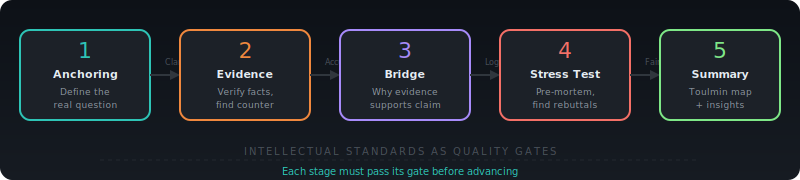
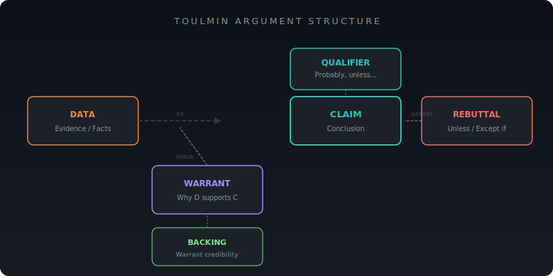

<div align="center">

# `/think-through`

### A Critical Thinking Engine for Claude Code

**5-stage reasoning state machine** that turns vague intuitions into structured arguments.

Built on [Toulmin](https://en.wikipedia.org/wiki/Toulmin_method) argument structure, [Paul-Elder](https://www.criticalthinking.org/pages/our-concept-and-approach/19) critical thinking elements, and [Intellectual Standards](https://www.criticalthinking.org/pages/universal-intellectual-standards/527) as quality gates.

[](https://docs.anthropic.com/en/docs/claude-code)
[](LICENSE)

<br/>

[Install](#install) · [Usage](#usage) · [How It Works](#how-it-works) · [Web Version](#lucidly----the-full-experience)

</div>

<br/>

---

## Why This Exists

> **"Figuring out what questions to ask will be more important than figuring out the answer."**
>
> — Sam Altman, CEO of OpenAI ([CNBC, Jan 2025](https://www.cnbc.com/2025/01/13/openai-ceo-top-ability-you-need-to-succeed-age-of-ai-ask-great-questions.html))

We live in a strange moment. AI can write code, draft essays, and pass bar exams — yet the most valuable human skill isn't *answering* questions, it's *asking* the right ones.

The World Economic Forum ranks **critical thinking and problem-solving as the #1 most in-demand skill for 2025** ([WEF Future of Jobs Report](https://www.weforum.org/publications/the-future-of-jobs-report-2025/)). Anthropic CEO Dario Amodei puts it simply: even in highly automated industries, **"someone needs to be steering — that's where humans remain"** ([The Adolescence of Technology](https://www.darioamodei.com/essay/the-adolescence-of-technology)).

The pattern is clear:

| What AI does well | What AI can't do for you |
|---|---|
| Generate answers | Know which question to ask |
| Summarize evidence | Judge if the evidence is trustworthy |
| Produce arguments | Detect your own blind spots |
| Optimize solutions | Question whether you're solving the right problem |

**AI is an accelerator, not a replacement, for human judgment** ([Thinkist](https://www.thinkist.com/the-age-of-ai-demands-a-critical-thinking-renaissance/)). The irony? The best way to sharpen your thinking might be to have AI *challenge* it — not agree with it.

That's what `/think-through` does.

---

## Demo

<div align="center">


<sub>A full 5-stage session: from vague question to structured Toulmin argument with bias detection</sub>

</div>

---

## Install

Copy the skill into your Claude Code skills directory:

```bash
# Clone
git clone https://github.com/MidniteCome/think-through.git

# Copy to Claude Code skills
cp -r think-through/SKILL.md ~/.claude/skills/think-through/SKILL.md

# Or if you prefer a symlink
mkdir -p ~/.claude/skills/think-through
ln -s "$(pwd)/think-through/SKILL.md" ~/.claude/skills/think-through/SKILL.md
```

That's it. Restart Claude Code and `/think-through` is ready.

---

## Usage

### Standalone Mode — Deep Reasoning Session

```
/think-through Should I quit my job to start a startup?
```

Walks you through all 5 stages with interactive questions, bias detection, and a final Toulmin-structured summary.

### Assist Mode — Quick Structured Thinking

```
/think-through assist Is this the right database schema for our use case?
```

Compressed into 2-3 exchanges. Gets you a verdict with confidence level and key risks, then returns control to your work.

---

## How It Works

### The 5-Stage State Machine

<div align="center">

</div>

<br/>

| Stage | Goal | Quality Gate | Key Technique |
|:---:|---|---|---|
| **1. Anchoring** | Crystallize a vague feeling into a specific question | Clarity | Fermi decomposition for overly broad questions |
| **2. Evidence** | Collect, verify, and challenge evidence | Accuracy + Breadth | Force counter-evidence (anti-WYSIATI) |
| **3. Bridge** | Articulate *why* evidence supports the claim | Logicalness | Warrant extraction — the invisible reasoning step |
| **4. Stress Test** | Find conditions where the conclusion *fails* | Fairness + Depth | Pre-mortem (Kahneman) + Confidence calibration (Tetlock) |
| **5. Summary** | Synthesize into a structured conclusion | — | Complete Toulmin diagram + bias report |

Each stage has a **pass condition** — you can't skip ahead until the quality gate is met.

### The Toulmin Backbone

Every reasoning session builds a [Toulmin argument](https://en.wikipedia.org/wiki/Toulmin_method) — the gold standard for structured argumentation:

<div align="center">

</div>

<br/>

Most people provide **Data** (evidence) and jump straight to a **Claim** (conclusion). They skip the **Warrant** — the reasoning that explains *why* the evidence actually supports the claim. Stage 3 (Inference Bridge) exists specifically to surface this invisible leap.

### Three Theoretical Frameworks

```
Toulmin     =  skeleton   →  ensures the argument has structure
Paul-Elder  =  compass    →  enriches thinking across 8 dimensions
Standards   =  gateway    →  quality control at each stage transition
```

The skill doesn't lecture you about frameworks. It uses them under the hood to generate **specific, substantive questions** about *your* actual content.

### Bias Detection

The skill watches for common reasoning traps and flags them in real-time:

- **Social Proof** — "Everyone says so" without concrete examples
- **Confirmation Bias / WYSIATI** — All evidence pointing one direction
- **Correlation ≠ Causation** — Post hoc reasoning
- **Halo Effect** — Logical leaps from evidence to conclusion
- **Optimism Bias** — Overconfidence in outcomes
- **Sample Size Neglect** — Generalizing from 1-2 examples

---

## Lucidly (洞悟) — The Full Experience

`/think-through` is the CLI distillation of **[Lucidly](https://lucidly-tau.vercel.app)**, a full-featured critical thinking web app with features that go beyond text:

<table>
<tr>
<td width="50%">

### Interactive Reasoning Canvas
SVG-based bubble map with pan & zoom. Watch your argument grow as nodes connect — premises, evidence, warrants, conclusions — all color-coded by Toulmin role and strength.

### Bias Radar Chart
Spider-web visualization of your detected biases across all sessions. See which cognitive traps you fall into most.

### Wrapped Annual Report
Spotify Wrapped, but for your thinking. 5-card swipeable deck:
- Your Thinking Type (16-type classification)
- Bias Radar
- Growth Curve (quality score over time)
- Breakthrough Session
- Next Quest (personalized challenge)

</td>
<td width="50%">

### 6 Training Exercises
- **Socratic Flow** — Guided Socratic questioning
- **Devil's Advocate** — Argument strengthening
- **Pre-Mortem** — Risk analysis
- **Persuasion Scan** — Detect rhetorical tactics
- **Decision Quality** — Multi-factor evaluation
- **Probability Calibration** — Prediction training

### Paul-Elder Octagon
Radial visualization of 8 thinking elements with relationship edges. Interactive hover reveals how Purpose connects to Assumptions connects to Implications.

### Shareable Cards
Canvas-rendered images of your Thinking Type and insights. Download and share your reasoning profile.

</td>
</tr>
</table>

<div align="center">

### [Try Lucidly →](https://lucidly-tau.vercel.app)

<sub>Built with Next.js + Supabase + Claude API. Dark theme. Bilingual (EN/中文).</sub>

</div>

---

## Philosophy

Most "AI thinking tools" are just wrappers around "here's a longer prompt." This is different.

The 5-stage state machine is derived from established frameworks in argumentation theory (Toulmin), critical thinking pedagogy (Paul-Elder), and cognitive psychology (Kahneman's pre-mortem, Tetlock's superforecasting, Annie Duke's decision quality).

The key insight: **AI shouldn't agree with you — it should challenge you.** Every stage is designed to increase friction where your thinking is weakest, and only move forward when the quality gate passes.

The result isn't a better answer. It's a better *question*.

---

## License

MIT

---

<div align="center">
<sub>Built by <a href="https://github.com/MidniteCome">William Choi</a> as part of the <a href="https://lucidly-tau.vercel.app">Lucidly (洞悟)</a> project.</sub>
</div>
